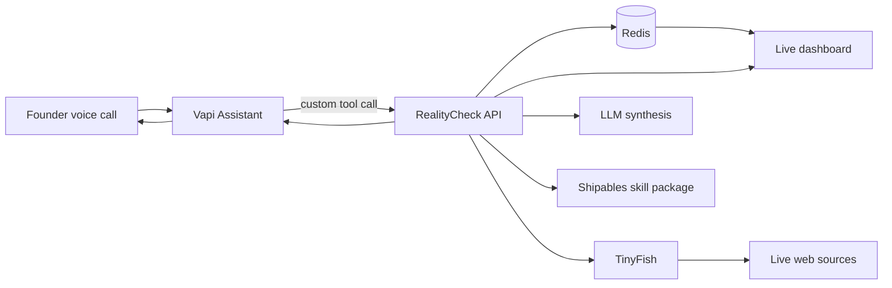

# Architecture

RealityCheck Live is a voice-first agentic research system. The implementation should be simple enough to build in one hackathon sprint, but structured enough to look like a real product.

## System Overview



## Components

### Vapi Assistant

Responsibilities:

- Start the conversation.
- Ask founder-style follow-up questions.
- Call backend tools.
- Speak short status updates.
- Read the final verdict naturally.

Recommended tools:

- `start_reality_check`
- `get_reality_check_status`
- `add_founder_clarification`
- `summarize_reality_check`

### RealityCheck API

Responsibilities:

- Receive Vapi tool calls.
- Normalize the idea into a structured founder brief.
- Create and update Redis run state.
- Dispatch TinyFish research tasks.
- Synthesize the market atlas.
- Serve dashboard state.

Recommended endpoints:

- `POST /api/vapi/tools`
- `POST /api/runs`
- `GET /api/runs/:id`
- `GET /api/runs/:id/events`
- `POST /api/runs/:id/research`
- `POST /api/runs/:id/synthesize`

### TinyFish Research Adapter

Responsibilities:

- Search for competitor and substitute evidence.
- Fetch clean text from high-value source URLs.
- Run targeted web-agent tasks for hard pages if needed.
- Return structured evidence with source URLs.

MVP calls:

- Search API for initial discovery.
- Fetch API for page extraction.
- Agent API with `/run-sse` for one impressive live automation if time permits.

### Redis Memory And State

Responsibilities:

- Run status and progress timeline.
- Conversation brief and transcript highlights.
- Evidence objects.
- Research task queue/state.
- Final market atlas.
- Optional semantic cache for repeated competitor queries.
- Optional vector search or vector sets for idea/evidence recall.

Suggested keys:

```text
rcl:run:{runId}                    JSON/hash for run metadata
rcl:run:{runId}:events             stream/list of progress events
rcl:run:{runId}:evidence           set/list of evidence ids
rcl:evidence:{evidenceId}          JSON/hash evidence object
rcl:run:{runId}:atlas              JSON/hash final market atlas
rcl:cache:search:{queryHash}       cached TinyFish search result
rcl:memory:idea:{ideaId}           optional vector/memory object
```

### Dashboard

Responsibilities:

- Show that the agent is actively working.
- Make sponsor tool usage obvious.
- Give judges a scannable market atlas.
- Preserve source credibility.

Required views:

- Live run state.
- Founder brief.
- Evidence feed.
- Competitor/substitute list.
- Brutal truth.
- Wedge and next experiment.
- Sponsor tool trace.

### Shipables Skill

Responsibilities:

- Package RealityCheck Live as a reusable agent workflow.
- Include clear instructions for using Vapi, TinyFish, Redis, and app endpoints.
- Include env var requirements.
- Include example prompts and tool contracts.

Suggested structure:

```text
skill/
  SKILL.md
  shipables.json
  references/
    realitycheck-workflow.md
    api-contracts.md
    demo-prompts.md
```

## Data Model

### Founder Brief

```json
{
  "idea": "string",
  "target_user": "string",
  "pain": "string",
  "current_alternative": "string",
  "why_now": "string",
  "constraints": ["string"],
  "unknowns": ["string"]
}
```

### Evidence

```json
{
  "id": "string",
  "run_id": "string",
  "task_id": "string",
  "url": "string",
  "title": "string",
  "snippet": "string",
  "claim": "string",
  "relevance": 0.0,
  "confidence": 0.0,
  "tags": ["competitor", "pricing", "pain", "trend"]
}
```

### Market Atlas

```json
{
  "one_line_thesis": "string",
  "score": 0,
  "brutal_truth": "string",
  "promising_wedge": "string",
  "target_icp": "string",
  "competitors": [
    {"name": "string", "url": "string", "notes": "string"}
  ],
  "substitutes": ["string"],
  "risks": ["string"],
  "next_experiment": "string",
  "evidence_ids": ["string"]
}
```

## Agent Loop

1. Intake: capture founder idea and missing context.
2. Decompose: create research questions.
3. Research: run TinyFish tasks.
4. Store: persist progress and evidence in Redis.
5. Evaluate: check whether there is enough evidence for a useful thesis.
6. Iterate: if evidence is weak, run one more targeted task.
7. Synthesize: produce the market atlas.
8. Respond: dashboard updates and Vapi speaks a concise result.

## Implementation Strategy

Build for reliability first:

- Use fixture fallback data for demo safety.
- Keep each external API behind an adapter.
- Make every adapter return typed JSON.
- Store raw responses when possible for debugging.
- Use short timeouts and visible partial progress.
- Prefer one strong TinyFish workflow over many fragile workflows.

## Failure Modes

TinyFish slow or rate limited:

- Return cached Redis evidence if available.
- Fall back to fixture evidence and label it as demo mode.
- Keep Vapi speaking status instead of waiting silently.

Vapi tool call mismatch:

- Accept both `toolCallList` and nested tool call formats.
- Return results with exact `toolCallId`.
- Log payloads during setup.

Redis unavailable:

- Use in-memory fallback only for local demos.
- Warn clearly in the UI.

LLM output invalid:

- Validate with schema.
- Retry once with repair prompt.
- Fall back to deterministic template.
